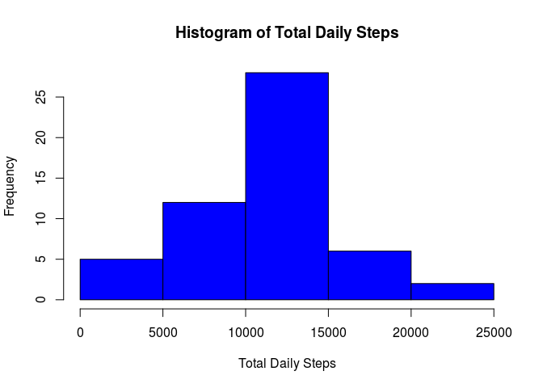
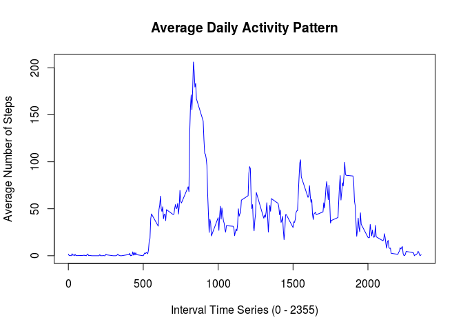
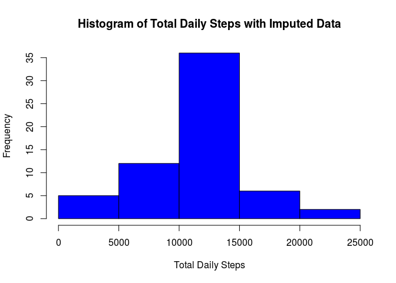
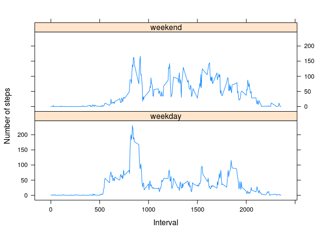

# Reproducible Research: Peer Assessment 1
Sudhanshu Garg  


```r
library(dplyr)
```

```
## 
## Attaching package: 'dplyr'
```

```
## The following objects are masked from 'package:stats':
## 
##     filter, lag
```

```
## The following objects are masked from 'package:base':
## 
##     intersect, setdiff, setequal, union
```

```r
library(lattice)
```

<br>

### Loading and preprocessing the data

Converting date to POSIXct format.


```r
data <- read.csv("activity.csv", stringsAsFactors=FALSE)
data$date <- as.POSIXct(data$date, format="%Y-%m-%d")
```

<br>

### What is mean total number of steps taken per day?

To calculate this, we use the aggregate function, over steps and date. Note the way aggregate function is called to maintain column names.


```r
dailyTotal <- aggregate(list(Steps = data$steps), list(Date = data$date), FUN = sum)
hist(dailyTotal$Steps, xlab="Total Daily Steps", main="Histogram of Total Daily Steps", col="blue")
```

<!-- -->

```r
meanSteps <- mean(dailyTotal$Steps, na.rm=TRUE)
medianSteps <- median(dailyTotal$Steps, na.rm=TRUE)
```

**The mean total number of steps are 1.0766189\times 10^{4}.**  
**The median total number of steps are 10765.**

<br>

### What is the average daily activity pattern?

Again we use the aggregate function, but this time with the mean function. The plot is generated using base plotting system.


```r
intervalAverage <- aggregate(list(Steps = data$steps), list(Interval = data$interval), FUN = mean, na.rm=TRUE)
with(intervalAverage, plot(Interval, Steps, type="l", col="blue", main="Average Daily Activity Pattern", xlab="Interval Time Series (0 - 2355)", ylab="Average Number of Steps"))
```

<!-- -->

**The 5-minute interval, which contains maximum number of steps, averaged across all the days in the dataset, is 835 with 206.17 steps.**

<br>

### Imputing missing values

1. The number of rows with NAs: 2304
2. Strategy for filling in missing values: *select mean of that interval across all days, convert to integer for sanity*
3. Create new dataset with missing values filled:

To create the new dataset with missing values filled, first we find which intervals have NA as entry for steps. Next we find the mean for that interval across all days from the datafram "internalAverage" and add it to the new dataframe impData.


```r
impData <- data
impData$steps <- ifelse(is.na(impData$steps), as.integer(intervalAverage[which(intervalAverage$Interval %in% impData$interval),]$Steps), impData$steps)
```

Next we calculate the total using aggregate function, as before and plot the histogram.


```r
impDailyTotal <- aggregate(list(Steps = impData$steps), list(Date = impData$date), FUN = sum)
hist(impDailyTotal$Steps, xlab="Total Daily Steps", main="Histogram of Total Daily Steps with Imputed Data", col="blue")
```

<!-- -->

```r
impMeanSteps <- mean(impDailyTotal$Steps, na.rm=TRUE)
impMedianSteps <- median(impDailyTotal$Steps, na.rm=TRUE)
```

**The mean total number of steps are 1.074977\times 10^{4}.**  
**The median total number of steps are 10641.**

So the mean decreased from 1.0766189\times 10^{4} to 1.074977\times 10^{4} (0.1524977%) and the median decreased from 10765 to 10641 (1.1518811%).

<br>

### Are there differences in activity patterns between weekdays and weekends?

First we add a column "day" to tell us whether a given day is weekday or weekend. Next we group by "interval, day" to subsequently calculate mean for the interval over weekdays and weekends separately. Finally, the plot is made using lattice system.


```r
impData$day <- as.factor(ifelse(weekdays(impData$date) == "Saturday" | weekdays(impData$date) == "Sunday", "weekend", "weekday"))
impData <- group_by(impData, interval, day)
avgImpData <- aggregate(impData$steps, by=list(impData$interval, impData$day), FUN = mean)
names(avgImpData) <- c("interval", "day", "steps")
xyplot(steps ~ interval | as.factor(day), data = avgImpData, layout = c(1,2), type="l", xlab="Interval", ylab="Number of steps")
```

<!-- -->
